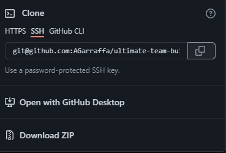
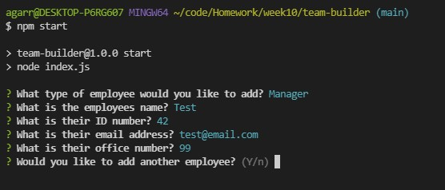

# Ultimate Team Builder

## Table of Contents
[Description](#description)

[Installation](#installation)

[Usage](#usage)

[Screenshots](#screenshots)

[Credits](#credits)

[Dependencies](#dependencies)

[Questions](#questions)

---

## Description
This is an app that can build a quick website with identifying information about a development team.
                
---     
## Installation
Navigate your browser to https://github.com/AGarraffa/ultimate-team-builder and using git bash type "git clone git@github.com:AGarraffa/ultimate-team-builder.git" (without quotes) to clone the repository to your desired directory. Then open the terminal (node.js required) and type "npm i" (without quotes) to install the required modules.

    
---
## Usage
In the terminal, type "npm start" (without quotes) to run the app. The app will then present the user with a series of prompts for information pertaining to a manager, engineer, and intern. Upon completion the app will generate index.html within the /dist directory. 

App in use

Video displaying the use of the app as well as testing can be found at: https://drive.google.com/file/d/1POLawERxMsWBaK5uDPcPfsIOGsO5GrR3/preview

App can be found at: https://github.com/AGarraffa/ultimate-team-builder.

---
## Future Development
Currently the styling is the biggest issue. Continued work will be done to make the page more visually appealing and presentable.

---
## Credits
* Alfred Garraffa
* Daniel Mrva 
* Amber Zimmerman 
* Lindsey Choi 

---
## Dependencies and Libraries
* inquirer 
* jest 
* materialize

---
## Questions
agarraffa@gmail.com

https://github.com/agarraffa

        
        
this file was created usings Alfred Garraffa's Readme generator
